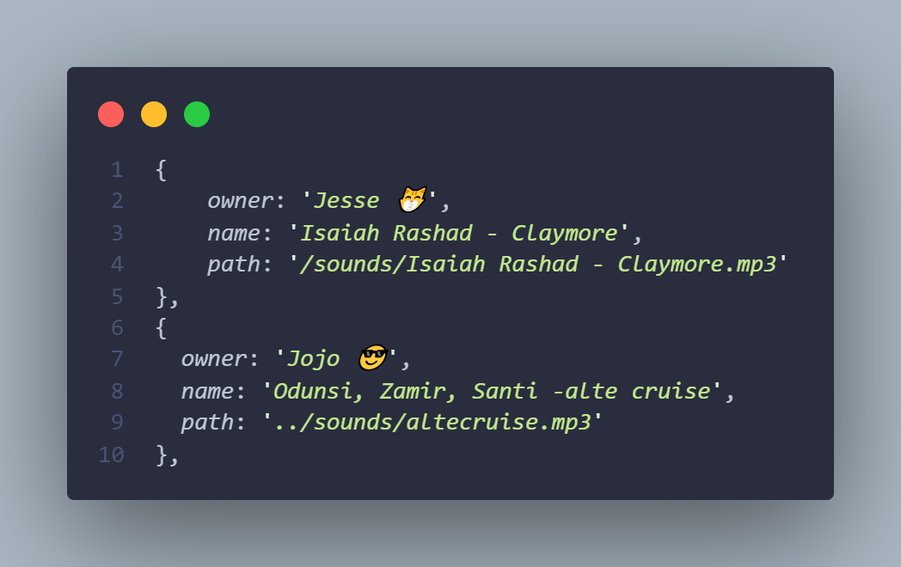

# Retro.Mp3
An online music player/radio where I and <a href="https://twitter.com/AkindeJo">Jojo</a> share our favorite playlists and songs
 
 
 
  
# Contributing Guide
> You can add to the songs on the web player,in few easy steps

<ul>
 <li>Fork this repository</li>
 <li>Clone this repository to your local machine 
 
 `
 $ git clone git@github.com:Akohjesse/Retro.Mp3.git
 `
 </li>
 <li>
 In your cloned version on your computer, add the remote
 
 `
 $ git remote add origin git://github.com/Akohjesse/Retro.Mp3
 `
 </li>
 
 <li>
   Pull changes that might have been made overtime
   
   `
   git pull`
 </li>
 </ul>
 
 ## Adding your Audio 
 > cd Into the sounds directory and add your own music there, <b>make sure the name of the song has no 'spaces',  or 'weird characters'</b> 
 
 
 <li>
 cd into the javascript file <code>/js/song.js</code> or easily go <a href="https://github.com/Akohjesse/Retro.Mp3/blob/main/js/songs.js">Here</a>
 </li>  
 
  
 <li>Create a new object into the <b>songs</b> array with your name,  name of the song and the path to the song in the <code>sounds</code> directory </li> 
 
    
 <li>Push to remote repository -  
   <code>git push -u origin {name_branch}</code>
 </li>
     
    
    

 
 

